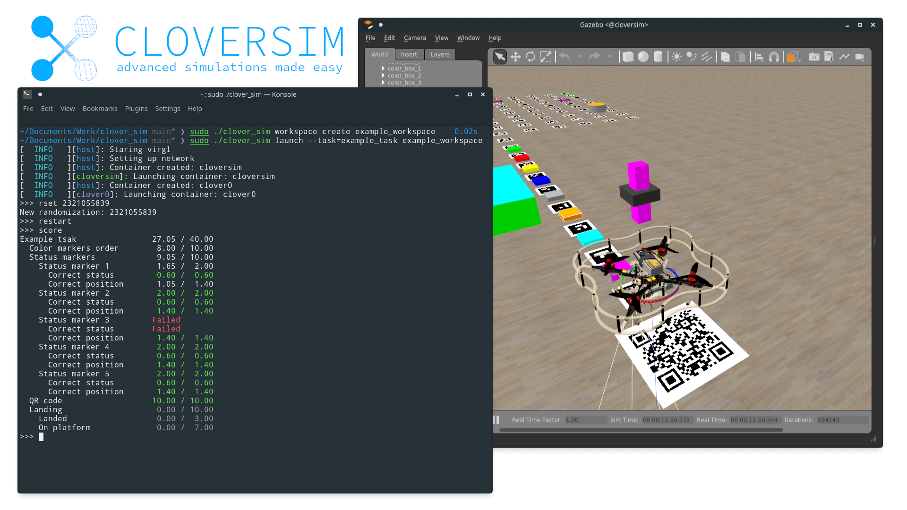

## Features
Simple and powerful tool for Clover simulation with workspaces and tasks.

Key features:

- Simple and fast way to start a simulator
- Workspaces concept that allows you to easily manage and share your projects
- Powerful tasks framework with ability to generate worlds and automatically check user solutions
- User code for clover doesn't have access to gazebo and can't cheat

## Installation


> Note for non-linux users, we recommend to install linux in dual-boot, but in case you don't have ability to instal: 
> * If you are using Windows 10 or higher check [WSL docs section](/wsl.md)
> * In other case use vmware virtual machine with ubuntu 20.04 or higher

> Currently installation is supported only on x86 systems

Dependencies:
- curl
- wget
- systemd-nspawn
- systemd-run
- iproute2
- iptables
- OpenGL drivers
- virglrenderer

Install dependency on Ubuntu:
```bash
sudo apt update && sudo apt install systemd-container libvirglrenderer1 iptables mesa-utils socat wget unzip libegl1-mesa
```

To install cloversim tool just run these commands:
```bash
mkdir clover_sim && cd clover_sim
curl https://raw.githubusercontent.com/FTL-team/clover_sim/main/setup.sh | bash
```

In case you have encounter problems with install script, check [manual installation section](/manual_install.md).

## Starting simulator

1. Go to `clover_sim` directory
2. Create workspace
    ```bash
    sudo ./clover_sim workspace create test
    ```
3. Launch simulator container
    - Simple start:
    ```bash
    sudo  ./clover_sim launch test
    ```
    - Start with some task:
    ```bash
    sudo ./clover_sim launch --task example_task test
    ```
    
> You can connect to your simulated clover drone using `ssh clover@192.168.77.10` password: **clover**

4. Enjoy simulator


> For more information check `sudo ../clover_sim help`