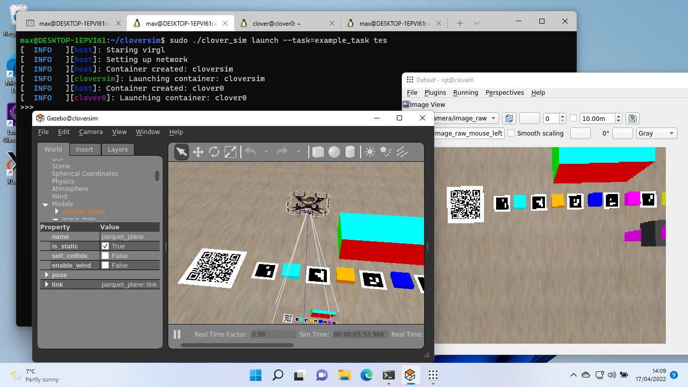
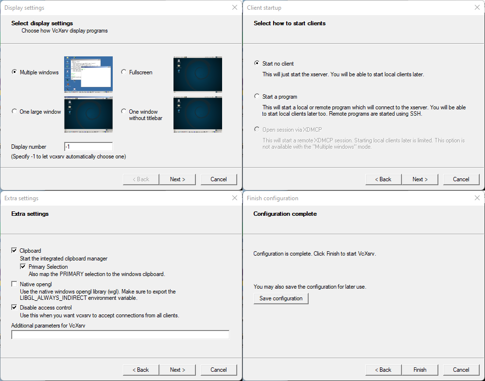

# Cloversim inside wsl



## Installation
1. Install wsl and ubuntu inside it:
   ```powershell
   wsl --install -d ubuntu
   ```
2. Install systemd inside ubuntu container and reboot your pc:
   ```bash
   curl -L -O "https://raw.githubusercontent.com/nullpo-head/wsl-distrod/main/install.sh"
   chmod +x install.sh
   sudo ./install.sh install
   ```
   Reboot your pc

3. Install [VcXsrv](https://sourceforge.net/projects/vcxsrv/)

4. Install cloversim dependencies:
   ```bash
   sudo apt update && sudo apt install systemd-container libvirglrenderer1 iptables mesa-utils socat wget unzip libegl1-mesa
   ```

5. Install cloversim tool:
   ```bash
   mkdir clover_sim && cd clover_sim
   curl https://raw.githubusercontent.com/FTL-team/clover_sim/main/setup.sh | bash
   ```

## Running cloversim
1. Launch VcXsrv:
   

2. Run this code in one wsl terminal:
   ```bash
   export HOSTIP=$(cat /etc/resolv.conf|grep nameserver|head -n 1|cut -d ' ' -f2)&&socat UNIX-LISTEN:/tmp/.X11-unix/X2,fork TCP-CONNECT:$HOSTIP:6000
   ```

3. Open new wsl terminal and run `export DISPLAY=:2`, now you can use cloversim.