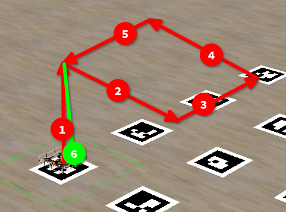

# Base clover task



This is base task for cloversim that provides world with 10 by 10 meters aruco map.

This task also contains simple checker, that tests flying in square with side of 1.
Exact steps drone should execute:

1. Takeoff
1. Fly 1m positive x
1. Fly 1m positive y
1. Fly 1m negative x
1. Fly 1m negative y
1. Land

## Step-by-step tutorial

1. To control drone flight we need to communicate with over ROS clover node. So we need to import rospy, init ROS node and connect to clover services:

   ```py
   import rospy
   from clover import srv
   from std_srvs.srv import Trigger
   import time

   rospy.init_node('flight')

   land = rospy.ServiceProxy('land', Trigger)
   get_telemetry = rospy.ServiceProxy('get_telemetry', srv.GetTelemetry)
   navigate = rospy.ServiceProxy('navigate', srv.Navigate)
   ```

2. First step of task is to take off land. To do this we need to call `navigate` with frame body, auto_arm enabled and z set to needed height:

   ```py
   navigate(frame='body', auto_arm=True, z=1)
   time.sleep(5)
   ```

   Try to run your program and see drone taking off, you should get points for Point A. (use reset simulator to move everything to initial state)

3. Next step is to flight in right directions to fly in square, this is achieved by using `navigate`:
   ```py
   navigate(frame='body', x=1)
   time.sleep(2)
   navigate(frame='body', y=1)
   time.sleep(2)
   navigate(frame='body', x=-1)
   time.sleep(2)
   navigate(frame='body', y=-1)
   time.sleep(2)
   ```

   Try to run your program, now drone should take off and fly in square, you should get 40 points. (use reset simulator to move everything to initial state)

4. To get final points you need to land drone with `land`:
    ```py
    land()
    ```